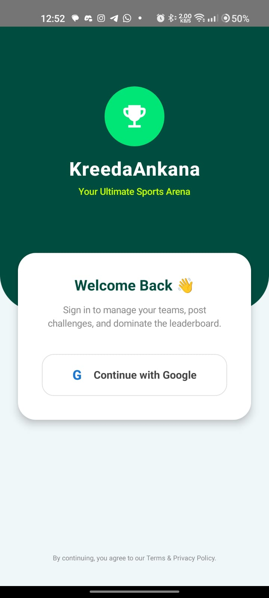
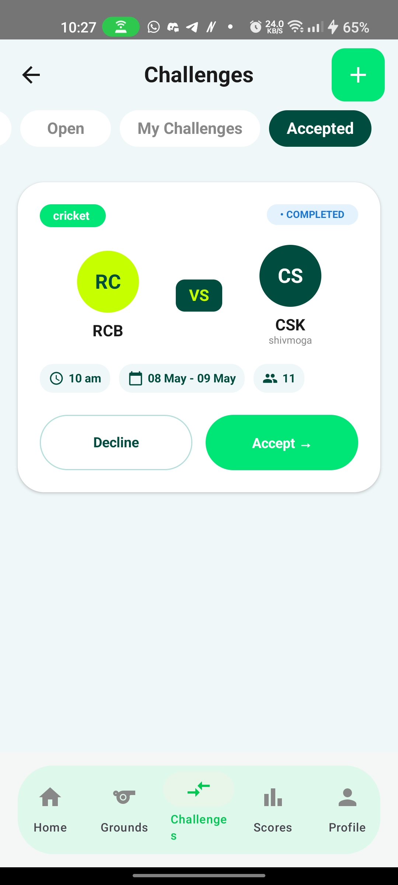
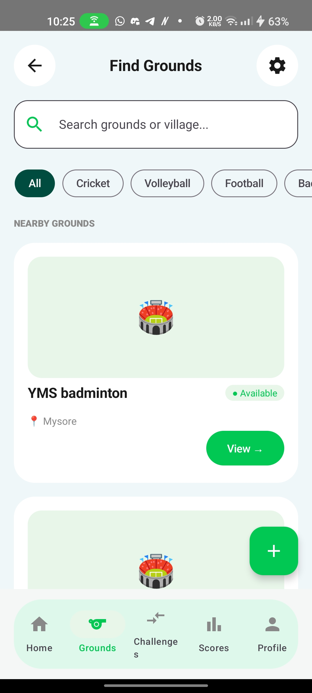
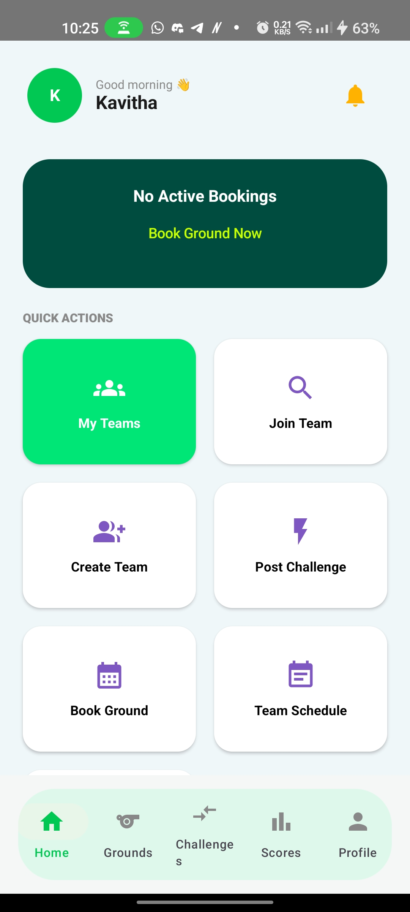
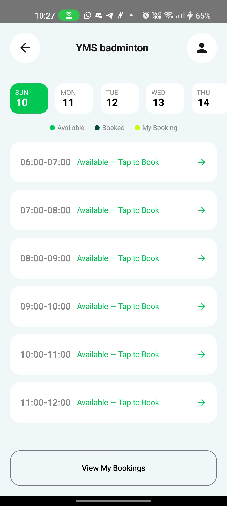

<div align="center">
  
# 🏆 KreedaAnkana
**Your Ultimate Local Sports Arena & Matchmaking Engine**


KreedaAnkana is a premium, real-time sports matchmaking and ground booking application. Built entirely with modern Android development paradigms (Jetpack Compose, MVVM, Coroutines) and Firebase, it empowers local sports teams to manage rosters, challenge opponents, securely verify match scores, and book local turf grounds.

### 📲 [Download the Latest APK & Try it Live](https://drive.google.com/file/d/1QMR0cOv18SONYmO20sO5DBwfPyQ6aFKL/view?usp=drive_link)

</div>

---

## 📑 Table of Contents
- [Core Features](#-core-features)
- [Screenshots](#-app-screenshots)
- [Architecture & Tech Stack](#-architecture--tech-stack)
- [Database Schema (NoSQL)](#-database-schema)
- [Technical Challenges Overcome](#-technical-challenges-overcome)
- [Getting Started](#-getting-started)

---

## ✨ Core Features

* **🛡️ Dual-Verification Matchmaking:** A strict, professional state-machine workflow. Teams post open challenges, negotiate via chat, lock matches in the calendar, and require **dual-admin consent** to verify final scores, effectively eliminating cheating and disputes.
* **🏟️ Turf & Ground Booking:** Users can browse local grounds, view dynamic calendars, and book specific time slots with real-time availability synchronization.
* **📊 The Score Wall:** A beautifully designed, globally accessible social feed that broadcasts officially verified match results, acting as a public leaderboard.
* **👥 Team Roster Management:** Create teams, assign role-based permissions (Captain/Admin), send dynamic invite notifications, and track automated Win/Loss statistics.
* **📱 Premium UI/UX:** Features a fully custom floating animated navigation bar, glassmorphic widgets, asymmetrical dashboards, and strict adherence to Material 3 design principles.

---

## 📸 App Screenshots

<table align="center">
  <tr>
    <td align="center"><b>Authentication & Dashboard</b></td>
    <td align="center"><b>Matchmaking & Chat</b></td>
    <td align="center"><b>Grounds & Booking</b></td>
  </tr>
  <tr>
    <td align="center"></td>
    <td align="center"></td>
    <td align="center"></td>
  </tr>
  <tr>
    <td align="center"></td>
    <td align="center"><br><i>Challenge Feeds, Negotiation Chat, and<br>Dual-Verification Calendar flows.</i></td>
    <td align="center"></td>
  </tr>
</table>

---

## 🏗️ Architecture & Tech Stack

This project strictly adheres to modern Android development standards, ensuring scalable, maintainable, and highly testable code.

* **UI Layer:** Jetpack Compose, Material 3
* **State Management:** `StateFlow`, `UiState` Pattern
* **Navigation:** Jetpack Navigation Compose (`NavHost`, dynamic arguments)
* **Architecture:** MVVM (Model-View-ViewModel) + Repository Pattern
* **Asynchrony:** Kotlin Coroutines & Flow (Safe, non-blocking UI operations)
* **Backend:** Firebase Firestore (Real-time NoSQL), Firebase Auth (Google Sign-In)
* **Cloud Infrastructure:** Firestore TTL (Time-To-Live) Policies for automated notification garbage collection.

---

## 🗄️ Database Schema

The Firestore NoSQL database is heavily normalized to prevent heavy reads and ensure snappy performance.

* `users/`: Core user profiles and authentication data.
* `teams/`: Team metadata, aggregated Win/Loss stats, and embedded roster arrays.
* `challenges/`: The core state machine documents. Transitions through `open` -> `negotiating` -> `scheduled` -> `pending_verification` -> `completed`. Includes a sub-collection for real-time negotiation chat messages.
* `grounds/` & `bookings/`: Relational mapping connecting physical turfs to specific user time slots.
* `team_notifications/`: Automated alerts governed by a **30-Day Google Cloud TTL Policy**.

---

## 🧠 Technical Challenges Overcome

**1. The Complex Matchmaking State Machine**
* **Problem:** Managing a match through 5 different stages across multiple authenticated users (Host Admin, Opponent Admin, standard players) while using a single source of truth document.
* **Solution:** Implemented sophisticated UI rendering logic based on intersectional state mapping. A single Compose card dynamically alters its physical layout and available buttons based on a combination of `match.status` and `currentUserRole`.

**2. Strict Data Privacy & "Ghost Matches"**
* **Problem:** When an open challenge received multiple responses, accepting one team inadvertently left the challenge data accessible to the rejected responders, causing data leaks into their calendars.
* **Solution:** Engineered strict algorithmic filtering at the `ViewModel` layer. Once a challenge transitions to `scheduled`, the flow forcefully filters out any users who do not match `isCreator || isTarget`, instantly securing the data from uninvited third parties.

**3. Asynchronous Dual-Verification**
* **Problem:** Traditional single-submit scorecards lead to platform disputes.
* **Solution:** Built a dual-verification locking mechanism. Admin A submits a score -> State becomes `pending_verification` -> Admin B is presented with a targeted UI to "Verify" or "Dispute" -> Upon verification, Firestore `FieldValue.increment(1)` atomically updates both teams' historical records simultaneously.

---

## 🚀 Getting Started (Developers)

To clone and run this project locally:

1. Clone the repository: 
   ```bash
   git clone [https://github.com/shreyasnnn/KreedaAnkana.git](https://github.com/YourUsername/KreedaAnkana.git)
   ```
2. Open the project in Android Studio (Iguana or newer recommended).
3. Firebase Setup: * Create a Firebase project and enable Firestore & Google Authentication.
  - Generate a `google-services.json` file and place it inside the `app/` directory.
  - Configure a TTL (Time-To-Live) policy on the `timestamp` field for the `team_notifications` collection.
4. Build and run on an emulator or physical device.
